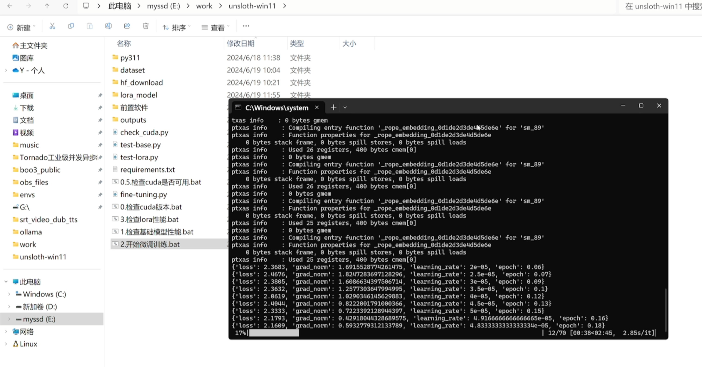

## Install the front software

Download files from https://pan.quark.cn/s/1fdc696007d2

1. Cuda12 and cuDNN
2. VC_redist.x64.exe
3. VisualStudioSetup.exe
4. LLVM-17.0.6-win64.exe

Configure all environment variables,And make sure there are no strange paths in the environment variables.

## Installation dependency

```
conda create -n unsloth python=3.11

conda activate unsloth
```

```
pip install torch==2.2.2 --index-url https://download.pytorch.org/whl/cu121
pip install --no-deps trl peft accelerate bitsandbytes
pip install deepspeed-0.13.1+unknown-py3-none-any.whl
pip install  triton-2.1.0-cp311-cp311-win_amd64.whl
pip install "unsloth[colab-new] @ git+https://github.com/unslothai/unsloth.git"
pip install xformers==0.0.25.post1
```

## FineTuning

```
python3 fine-tuning.py
```

